# ggVolcanoR

This is the README.md file containing information on the features of the application
Please contact: Chen.Li@monash.edu or Kerry.Mullan@monash.edu for reporting errors.

Run the following command in R or Rstudio to download and install the required packages
```
install.packages(c("tidyverse", "ggplot2", "ggrepel", "shiny", "shinyBS", "gridExtra", "DT", "plyr", "dplyr", "reshape2"))
```

## file types accepted
The file must contain headers: ID, logFC and Pvalue. 
Unique ID names are preferred especially when labelling the graph
This needs to be in the form of either a **.csv** or **.txt** file

## uploading the file


## types of graphs
There are **three** different types of graphs that differ on how the graph is labeled. 

* **Unlabeled graph**
  - the table will render the first 20 points, but can include the total range of values. 
  

  
* **range of genes** 
  - default list the top 20
  - This looks at both up and down directions

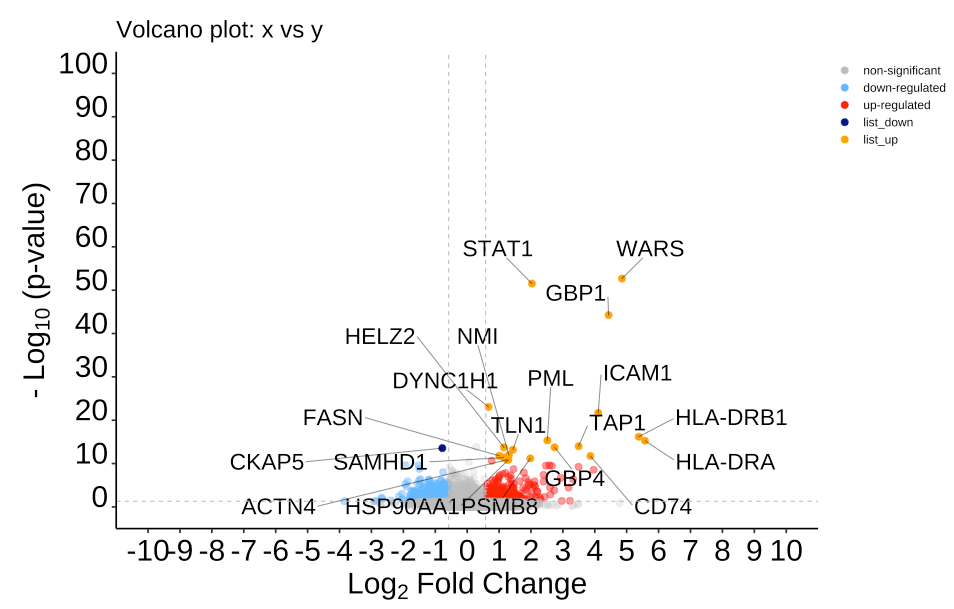
  
* **own list** 
  - will label the first 20
  - colors might be different than expect if only labeling one direction of transcripts
  
  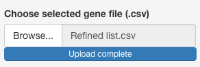
  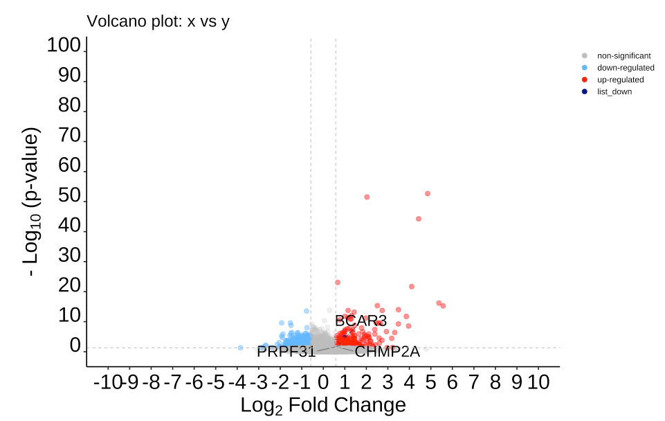
## Types of font
There are three font types available for the plot

This includes **Arial (Default)**, Times New Roman and Courier

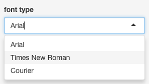

## Cut-offs
P-value and log2 fold change can be altered in the plot. These are reactive numerical inputs. They will accept scientific formats i.e. 1e-5. 
These are represented by the horizontal and vertical dotted lines on the graph (Default=grey)

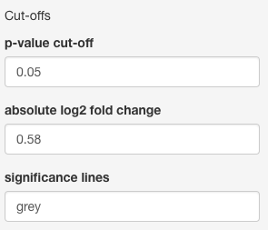

## Axis paramaters
Select label
- p-value, FDR (false discovery rate; out-put of EdgeR) or adj p-value (which could include other p-value corrections)

axis 
- y-axis from 0 onward with the default being 100. To identify the top hit, look at the exponent on the P-value (i.e. 1e-50) and then add 5 to cover that point i.e. 55
- x-axis default from -10 to 10. 

axis break
- denotes how often the tick marks occur 
  - y-axis every 10
  - x-axis every 1

font size (range 0 to 100) 
- text size 
- number size 

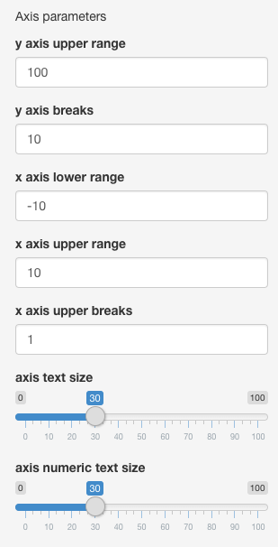

## point parameters
point size (Default 3)
Coloring the dots
- no label (3 colors)
- Range of ID and Selected ID have up to 5 colors
  - if only one direction is being labeled the legend text can be changed to accommodate 4 parameters

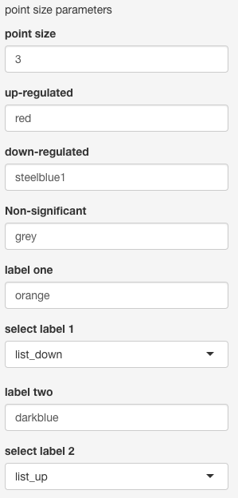

Transparency of points
- There are 3 transparencies that can be altered
  - Non-significant (default = 0.25)
  - significant (default = 0.5)
  - labeled  (default = 1)

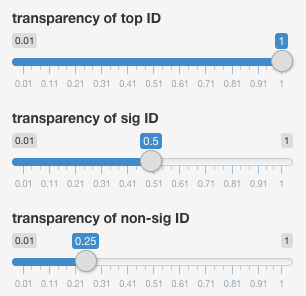

## Number of labels on graph an in table
No lables
- lists all ID's in the table 

Range of ID
- default = 1 to 20, but can choose any range for both the graph and is reflected in the table
- Do not recommend more than 30 points to be listed due to crowding of the labels as well as size

Own list
- Graph will lable all signficint points
- graph will list all points

These can either be the range or the own list of ID
the user can chose to alter
- the number of labels (default is 20, but would not recommend more than that due to crowding on the image)
- distance from the labeled point
- text size 


## Legend Parameters
These include:
- size of legend text
- location of legend (default=right)
- of columns for the legend (default 1); recommend using 2-5 when the legend is below

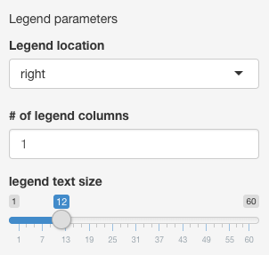

## Other features
The title of the graph can be changed for export purposes

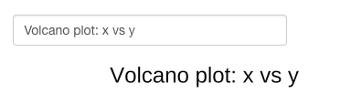

## explorting the graph
the user defined parameters will be the same as the exported graph. 
There are two download options. 
- PDF (default: height=8 and width=10)
- png (default assumes legend is present at the 1200 by 1600; recommended to change to 1200 by 1200)
- if the user wishes to increase the resolution, all point parameters will be affected. 

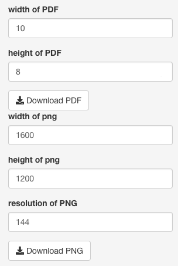

## Table parameters
Based on the graph select will etierh show:  no labels (all), range (1 to 20) and selected (own list)
The table links to several databases:
- GeneCards 
- The human protein atlas (atlas)
- UniProt 16 species (UniProt_species)
- UniProt other species (UniProt_other)

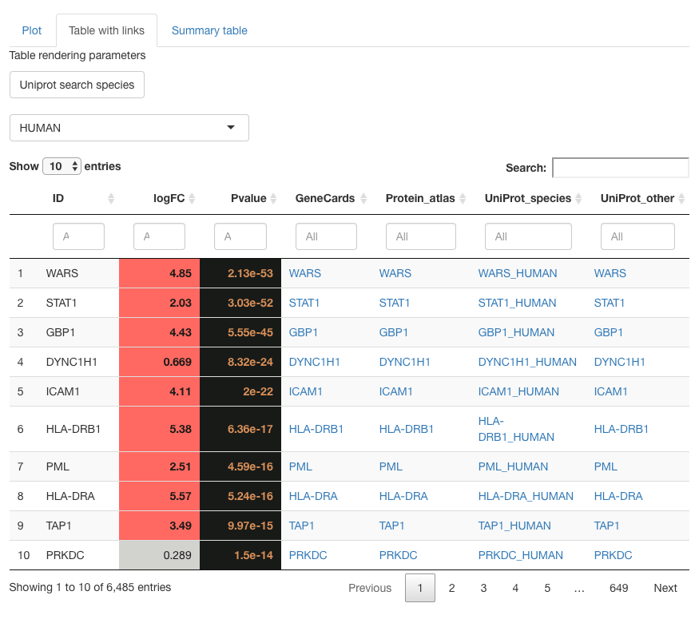

## summary table and explorting filtered list

The summary table contains the total number of differentially expresssed genes (no labels and range) or the number of significant and non-significant ID's in the list

The files can be exported as either all significant labels for:
- positive
- negative
- both directions
- own list

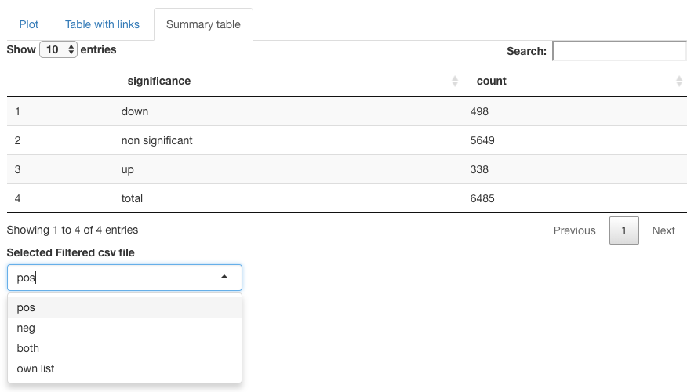
