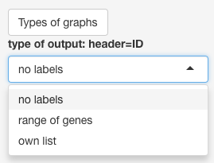
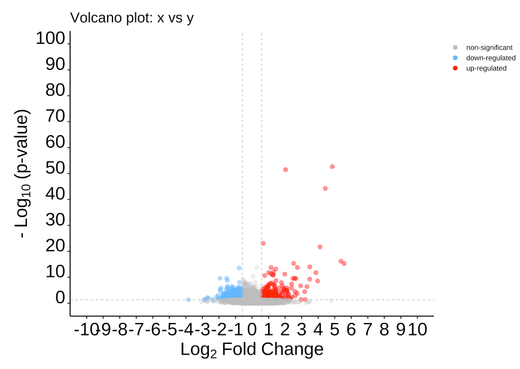
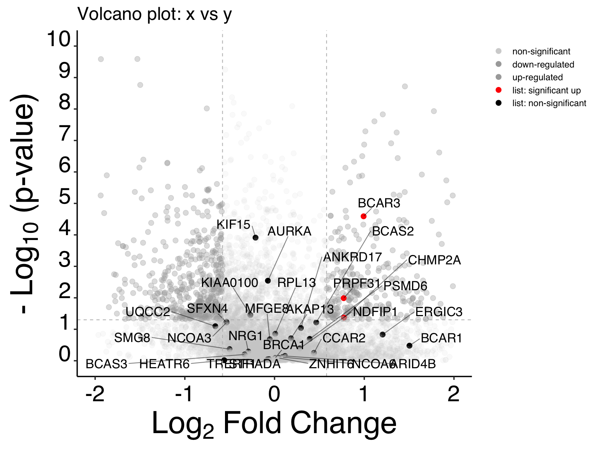
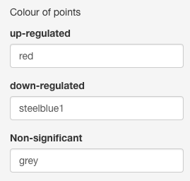
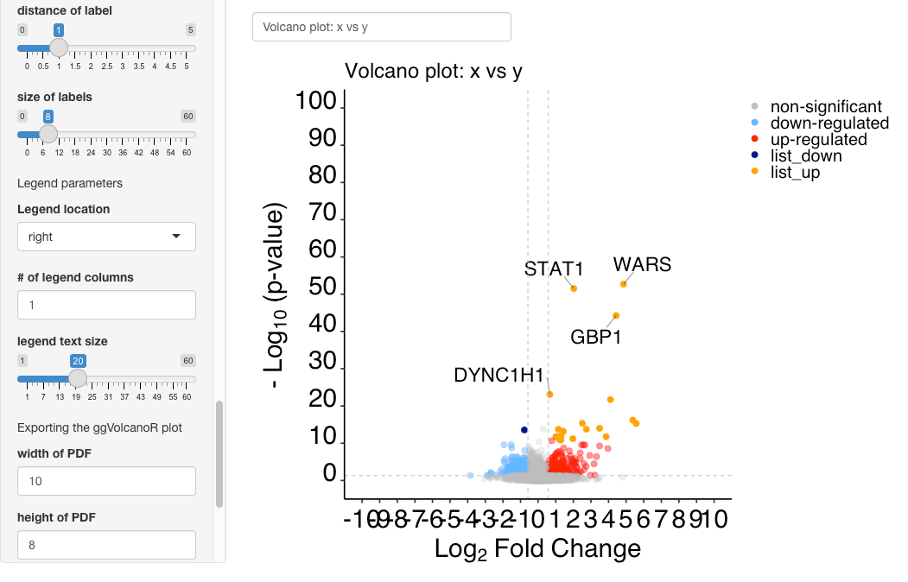
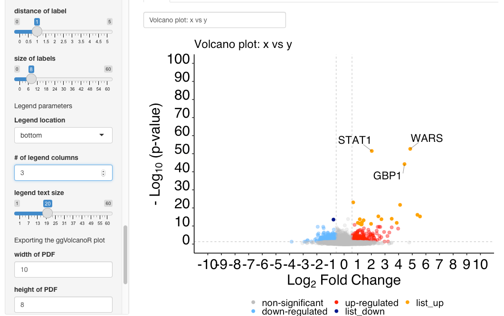

# ggVolcanoR

This is the README.md file containing information on the features of the application.

Please contact: Chen.Li@monash.edu or Kerry.Mullan@monash.edu to report errors.

If using the local GitHub, run the following command in R or Rstudio to download and install the required packages
```
install.packages(c("tidyverse", "ggplot2", "ggrepel", "shiny", "shinyBS", "gridExtra", "DT", "plyr", "dplyr", "reshape2"))
```

## file types accepted

The file must contain headers: ID, logFC and Pvalue. 

Unique ID names are preferred especially when labelling the graph.

This needs to be in the form of either a **.csv** or **.txt** file

see the test-data format in the GitHub repository or download by setting the significance threholds to 0. 

## uploading the file

Select browse and you can search your system for your differental expression file. 


## types of graphs

### Three labelling options are available for plotting. 



### Unlabeled graph
Shows all data points without any text labels. 


  
### range of genes
 - The most dysregulated genes are selected, by default the top 20 most dysregulated genes/proteins are selected. This can be modified by the user. 
  - This of list is based on p-value and not direction of logFC. 
  - The range can be from x to y
  - Do not recommend more than 30 points labelled


  
 #### Own list

  

- This will label the uploaded list of genes/proteins if they meet the significance threshold.  
- By default, the 20 most dysregualted genes/proteins in the list will be annotated with text in the graph. This can be modified by the user. 
- A user can chose the range (x to y) 
- Do not recommend more than 30 points labelled

  

## Types of font
There are three font types available for the plot.

This includes **Arial (Default)**, Times New Roman and Courier


## Cut-offs
Thresholds for significance can be altered (Default: Pvalue=0.05 and absolute logFC=0.58) 
These are represented by the horizontal and vertical dotted lines on the graph (Default=grey)


## Axis parameters 
Select label
- p-value, FDR (false discovery rate; out-put of EdgeR) or adj p-value (which could include other p-value corrections)

axis 
- y-axis from 0 onward with the default being 100. To identify the top hit, look at the exponent on the P-value (i.e. 1e-50) and then add 5 to cover that point i.e. 55
- x-axis default from -10 to 10. 

axis tick marks
- denotes how often the tick marks occur 
  - y-axis every 10
  - x-axis every 1

font size (range 0 to 100) 
- text size 
- number size 


## point parameters
The size of the point can be altered (Default 3)

Coloring the dots
- no label (3 colors)
    - Up-regulated (red), down-regulated (light blue) and non-significant (gray)
    

    
- "range of genes"and "own list" have up to 6 colors to differentiate the points
    - list one (orange), list two (dark blue), list three (purple), up-regulated (red), down-regulated (light blue) and non-significant (gray)
    - the legend lables for the list can be changed to: list: significant up, list: significant down and list: non-significant


Transparency of points
- There are 3 transparencies that can be altered: 
  - Non-significant (default = 0.25)
  - significant (default = 0.5)
  - labeled  (default = 1)


## Legend Parameters


The legend can be altered in the following ways:
- Size of text
- location of legend (default=right)
- If the legend is to be displayed below the text, it will be presented in one column. We recommend changing this to 3 to fit all under the graph. 




## Other features
The title of the graph can be changed for export purposes


## Exporting the graph
The graph will be exported with the current user defined parameters.

There are two download options: 
1. PDF (default: height=8 and width=10)
2. png (default assumes legend is present at the 1200 by 1600; recommended to change to 1200 by 1200)
    - if the user wishes to increase the resolution, all point parameters will be affected. 


## Table with links 
Based on the labelling option selected the table will show the following:

no labels - all imported gene IDs

range of genes - top 1-x dysregulated genes

own list - user defined list of genes


The table includes links to several databases:  
- GeneCards 
- The human protein atlas (atlas)
- UniProt 16 species (UniProt_species)
    * If the user is using one of the 16 common species, they can select this from the list. 
    * Using the Symbol_species, aided in finding the correct information. 
    
- UniProt other species (UniProt_other)
    * if a non-standard species is being used or uniprot ID's, use this column to find the related information. 


## summary table and exporting the filtered list

The summary table contains the total number of differentially expressed genes (no labels and range of genes) or the number of significant and non-significant ID's in the list

The following filtered data lists can be downloaded as csv files (note that significance is based on user defined parameters):
- upregulated
- downregualted
- all significant dysregualted
- own list (significant values only)


## Packages cited 
Auguie, B., A. Antonov and M. B. Auguie (2017). "gridExtra: Miscellaneous Functions for "Grid" Graphics. R package version 2.3. https://CRAN.R-project.org/package=gridExtra."

Bailey, E. (2015). "shinyBS: twitter bootstrap components for Shiny. R package version 0.61. https://CRAN.R-project.org/package=shinyBS."

Chang, W., J. Cheng, J. Allaire, Y. Xie and J. McPherson (2020). "shiny: Web Application Framework for R. R package version 1.5.0. https://CRAN.R-project.org/package=shiny."

Slowikowski, K. (2020). ggrepel: Automatically Position Non-Overlapping Text Labels with’ggplot2’.

Villanueva, R. A. M. and Z. J. Chen (2019). ggplot2: Elegant graphics for data analysis, Taylor & Francis.

Wickham, H. (2007). "Reshaping data with the reshape package." Journal of statistical software 21(12): 1-20.

Wickham, H. (2011). "The split-apply-combine strategy for data analysis." Journal of statistical software 40(1): 1-29.

Wickham, H., M. Averick, J. Bryan, W. Chang, L. D. A. McGowan, R. François, G. Grolemund, A. Hayes, L. Henry, J. Hester, M. Kuhn, T. L. Pedersen, E. Miller, S. M. Bache, K. Müller, J. Ooms, D. Robinson, D. P. Seidel, V. Spinu, K. Takahashi, D. Vaughan, C. Wilke, K. Woo and H. Yutan (2019). Welcome to the tidyverse, Welcome to the tidyverse. 4: 1686.

Wickham, H., R. François, L. Henry and K. Müller (2020). dplyr: a grammar of data manipulation.

Xie, Y., J. Cheng and X. Tan (2020). DT: A Wrapper of the JavaScript Library “DataTables”.
