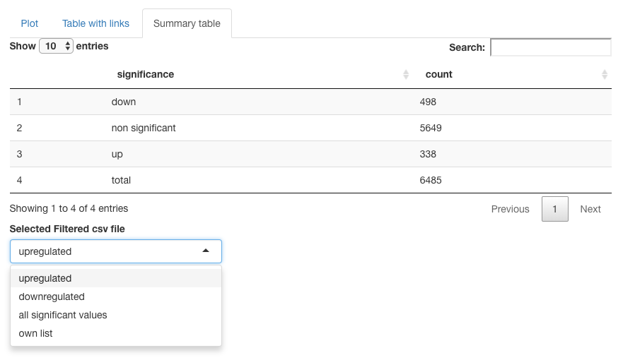

# ggVolcanoR

This is the README.md file containing information on the features of the application.

Please contact: Chen.Li@monash.edu or Kerry.Mullan@monash.edu to report errors.

If using the local GitHub, run the following command in R or Rstudio to download and install the required packages. 

```
install.packages("devtools")
devtools::install_github("KerryAM-R/ggVolcanoR")
ggVolcanoR::runApp()

```

If the application does not install the dependencies, run the following lines of code

```
install.packages(c("tidyverse", "ggplot2", "ggrepel", "shiny", "shinyBS", "gridExtra", "DT", "plyr", "dplyr", "reshape2","colourpicker","devtools"), type="source")
devtools::install_github("jokergoo/ComplexHeatmap")
```

you may need to install Rtools (windows)

## Cite the ggVolcanoR Publication

https://www.sciencedirect.com/science/article/pii/S2001037021004426 

Mullan, K. A. et al. ggVolcanoR: A Shiny app for customizable visualization of differential expression datasets. Comput Struct Biotechnol J 19, 5735-5740, doi:10.1016/j.csbj.2021.10.020 (2021).

link to endnote citation: https://scholar.googleusercontent.com/scholar.enw?q=info:iH49o0Dmh9IJ:scholar.google.com/&output=citation&scisdr=CgWwAUR_EKqTkAVW0aU:AAGBfm0AAAAAYo1QyaVOL_NHxsGLBg0LKFXUw0mRb6iU&scisig=AAGBfm0AAAAAYo1Qye3a8GD_ewiuc6k5PjecPTn6kHDf&scisf=3&ct=citation&cd=-1&hl=en

## File types accepted

The file must contain headers: ID, logFC and Pvalue. 

Unique ID names are preferred especially when labelling the graph.

This needs to be in the form of either a **.csv** or **.txt** file.

See the test-data format in the GitHub repository or download by setting the significance thresholds to 0. 

## Uploading the file and types of graphs

### Select browse and you can search your system for your differential expression file. 

### Five labelling options are available for plotting. 


## Example plot


## Fonts Available

This includes **Arial (Default)**, Times New Roman and Courier.


## Cut-offs
Thresholds for significance can be altered (Default: Pvalue=0.05 and absolute logFC=0.58).

These are represented by the horizontal and vertical dotted lines on the graph (Default=grey).


## Axis Parameters 
Type in y-axis label which could be:
- p-value
- FDR (false discovery rate; out-put of EdgeR) 
- adj p-value (which could include other p-value corrections)

Axis 
- y-axis from 0 onward with the default being 100. 
- x-axis default from -10 to 10. 

Axis tick marks
- denotes how often the tick marks occur. 
- y-axis every 10.
- x-axis every 1.

Font size (range 0 to 100) 
- text size. 
- number size. 


## Point Parameters

For each of the datapoints, the colour, shape, size and transparency

 

### The user can also colour the genes based on the addition of the labelled points

The "range of genes" and "own list" have up to 6 colors to differentiate the points. 
- list one (orange), list two (dark blue), list three (purple), up-regulated (red), down-regulated (light blue) and non-significant (gray).
- the legend lables for the list can be changed to: list: significant up, list: significant down and list: non-significant.

 

## Label and Legend Parameters

The legend can be altered in the following ways:
- Size of text
- location of legend (default=right)
- If the legend is to be displayed below the text, it will be presented in one column. We recommend changing this to 3 to fit all under the graph. 

 

## Other features
The title of the graph can be changed for export purposes

The user can also download these features if desired for future reference. 

## Exporting the graph
The graph will be exported with the current user defined parameters.

There are two download options: 

1. PDF (default: height=8 and width=10)

2. png (default assumes legend is present at the 1200 by 1600; recommended to change to 1200 by 1200)
    - if the user wishes to increase the resolution, all point parameters will be affected. 


## Table with links 
Based on the labelling option selected the table will show the following:

No labels - all imported gene IDs

Range of genes - top 1-x dysregulated genes

Own list - user defined list of genes


The table includes links to several databases:  
- GeneCards 
- The Human Protein Atlas (atlas)
- UniProt 16 species (UniProt_species)
    * If the user is using one of the 16 common species, they can select this from the list. 
    * Using the Symbol_species, aided in finding the c
    orrect information. 
    
- UniProt other species (UniProt_other)
    * If a non-standard species is being used or uniprot ID's, use this column to find the related information. 


## Summary table and exporting the filtered list

The summary table contains the total number of differentially expressed genes (no labels and range of genes) or the number of significant and non-significant ID's in the list

The following filtered data lists can be downloaded as .csv files (note that significance is based on user defined parameters):
- Upregulated
- Downregulated
- All significantly dysregulated
- Own list (significant values only)



## Packages cited 
Auguie, B., A. Antonov and M. B. Auguie (2017). "gridExtra: Miscellaneous Functions for "Grid" Graphics. R package version 2.3. https://CRAN.R-project.org/package=gridExtra."

Bailey, E. (2015). "shinyBS: twitter bootstrap components for Shiny. R package version 0.61. https://CRAN.R-project.org/package=shinyBS."

Chang, W., J. Cheng, J. Allaire, Y. Xie and J. McPherson (2020). "shiny: Web Application Framework for R. R package version 1.5.0. https://CRAN.R-project.org/package=shiny."

Slowikowski, K. (2020). ggrepel: Automatically Position Non-Overlapping Text Labels with’ggplot2’.

Villanueva, R. A. M. and Z. J. Chen (2019). ggplot2: Elegant graphics for data analysis, Taylor & Francis.

Wickham, H. (2007). "Reshaping data with the reshape package." Journal of statistical software 21(12): 1-20.

Wickham, H. (2011). "The split-apply-combine strategy for data analysis." Journal of statistical software 40(1): 1-29.

Wickham, H., M. Averick, J. Bryan, W. Chang, L. D. A. McGowan, R. François, G. Grolemund, A. Hayes, L. Henry, J. Hester, M. Kuhn, T. L. Pedersen, E. Miller, S. M. Bache, K. Müller, J. Ooms, D. Robinson, D. P. Seidel, V. Spinu, K. Takahashi, D. Vaughan, C. Wilke, K. Woo and H. Yutan (2019). Welcome to the tidyverse, Welcome to the tidyverse. 4: 1686.

Wickham, H., R. François, L. Henry and K. Müller (2020). dplyr: a grammar of data manipulation.

Xie, Y., J. Cheng and X. Tan (2020). DT: A Wrapper of the JavaScript Library “DataTables”.
